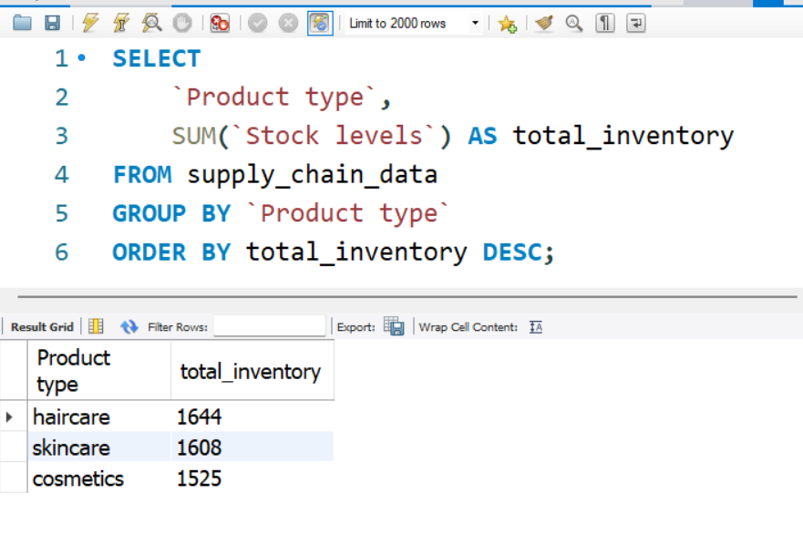
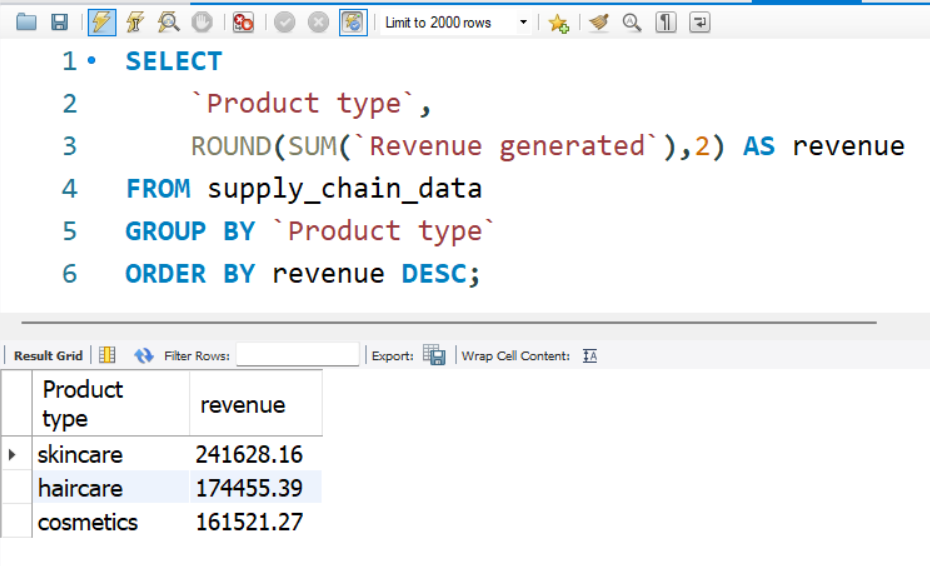
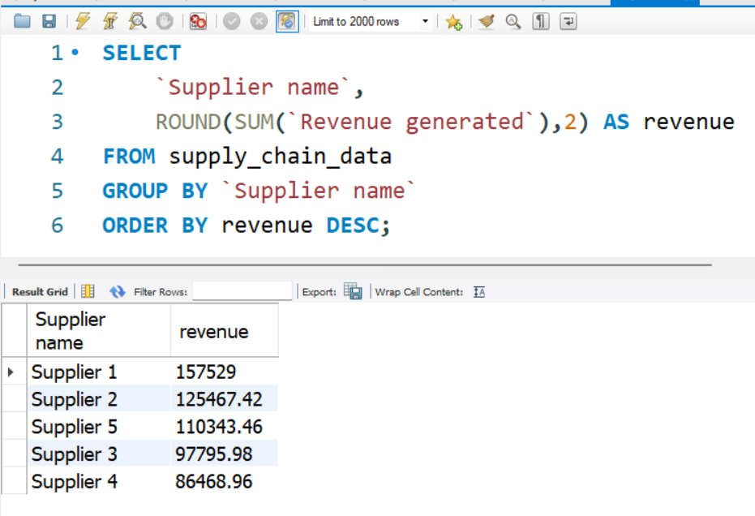
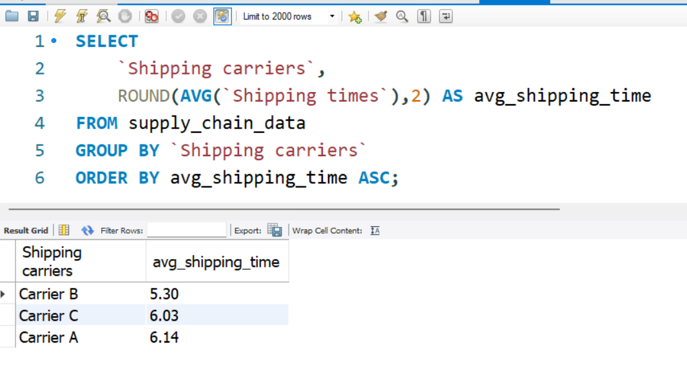

# Supply Chain & Inventory Performance Analytics Using SQL

## Project Overview

This project analyzes supply chain operations, inventory management, supplier performance, revenue generation, and shipping efficiency using SQL.

The goal is to transform raw operational data into actionable business insights that support data-driven decision-making for inventory planning, supplier management, and logistics optimization.

---

## Business Problem

Supply chain organizations often face challenges such as:

- Inventory shortages
- Overstocking
- Supplier quality issues
- Shipping delays
- Revenue optimization

This project uses SQL to identify operational bottlenecks and uncover business opportunities through data analysis.

---

## Dataset Information

**Dataset Name:** Supply Chain Dataset

**Total Records:** 100

### Key Attributes

- Product Type
- SKU
- Price
- Availability
- Products Sold
- Revenue Generated
- Customer Demographics
- Stock Levels
- Lead Times
- Order Quantities
- Shipping Times
- Shipping Costs
- Supplier Name
- Transportation Modes
- Routes
- Defect Rates

---

## Tools & Technologies

- MySQL
- SQL
- Excel
- GitHub

---

## Project Structure

```text
Supply-Chain-Inventory-Analytics

├── Dataset
│   └── supply_chain_data.csv
│
├── Insights
│   ├── inventory_insights.md
│   ├── revenue_insights.md
│   ├── supplier_insights.md
│   ├── shipping_insights.md
│   └── advanced_sql_insights.md
│
├── Screenshots
│   ├── inventory_analysis.png
│   ├── revenue_analysis.png
│   ├── supplier_analysis.png
│   └── shipping_analysis.png
│
├── 01_database_exploration.sql
├── 02_inventory_analysis.sql
├── 03_revenue_analysis.sql
├── 04_supplier_analysis.sql
├── 05_shipping_analysis.sql
├── 06_advanced_sql_analysis.sql
│
├── executive_summary.md
└── README.md
```

---

## Analysis Performed

### 1. Database Exploration

- Total Records
- Unique Product Types
- Unique Suppliers
- Transportation Modes
- Shipping Carriers
- Inspection Results

### 2. Inventory Analysis

- Total Inventory by Product Type
- Highest Stock Product
- Lowest Stock Product
- Inventory Distribution

### 3. Revenue Analysis

- Total Revenue Generated
- Revenue by Product Category
- Top Revenue-Producing Products
- Average Revenue by Category

### 4. Supplier Analysis

- Supplier Revenue Ranking
- Supplier Lead Time Analysis
- Supplier Cost Analysis
- Supplier Defect Rate Analysis

### 5. Shipping Analysis

- Shipping Cost Comparison
- Carrier Performance Analysis
- Route Performance Analysis
- Delivery Time Optimization

### 6. Advanced SQL Analysis

- Window Functions
- Ranking Functions
- CASE Statements
- Revenue Contribution Analysis
- Supplier Performance Classification

---

## Key Business Insights

### Revenue Insights

- Total revenue generated: **$577,604.82**
- Skincare generated the highest revenue: **$241,628.16**
- SKU51 was the highest revenue-generating product.

### Inventory Insights

- Haircare maintained the highest inventory level (**1,644 units**).
- Several products were identified as low-stock items requiring replenishment.

### Supplier Insights

- Supplier 1 generated the highest revenue.
- Supplier 1 also maintained the lowest defect rate.
- Supplier 4 had the highest average procurement cost.

### Shipping Insights

- Carrier B achieved the fastest average shipping time.
- Route C demonstrated the best delivery performance.
- Sea transportation had the lowest shipping cost.

---

## Business Recommendations

### Inventory Management

- Monitor low-stock SKUs closely.
- Implement proactive replenishment strategies.

### Revenue Growth

- Prioritize skincare products due to strong revenue performance.
- Focus marketing efforts on high-performing SKUs.

### Supplier Management

- Strengthen relationships with Supplier 1.
- Review Supplier 4 and Supplier 5 for optimization opportunities.

### Logistics Optimization

- Increase utilization of Carrier B.
- Prioritize Route C for time-sensitive deliveries.

---

## Project Screenshots

### Inventory Analysis



### Revenue Analysis



### Supplier Analysis



### Shipping Analysis



---

## SQL Skills Demonstrated

- SELECT
- WHERE
- GROUP BY
- ORDER BY
- Aggregate Functions
- CASE Statements
- Window Functions
- RANK()
- DENSE_RANK()
- Subqueries
- Business KPI Analysis

---

## Future Improvements

- Build Power BI Dashboard
- Create Interactive Inventory Dashboard
- Add Forecasting Models
- Develop Supplier Performance Scorecards
- Integrate Real-Time Supply Chain Data

---

## Author

**Tauhid Hossain**

Aspiring Data Analyst

GitHub: https://github.com/tauhidhossain8899

